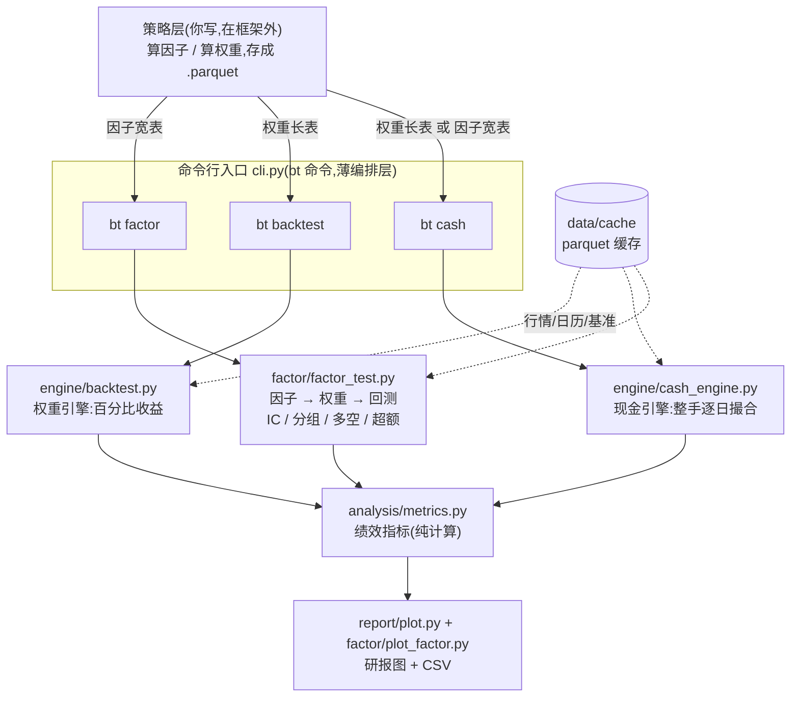
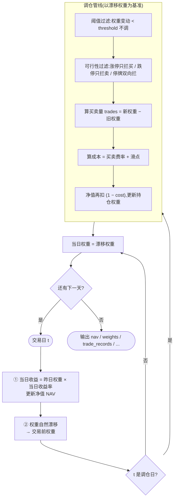
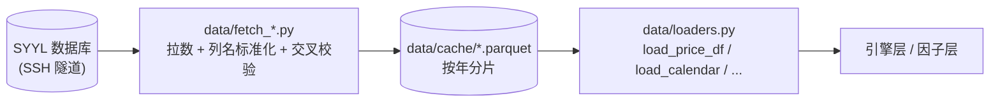

# A 股量化回测框架

面向 A 股系统性因子研究的个人回测框架。一句话定位:**策略层输出权重表(`weights_df`),引擎层执行回测,两者完全解耦**。策略怎么算因子、怎么生成权重,框架不管;框架负责把权重 + 行情翻译成净值曲线、绩效指标和研报图。

三条命令对应三种研究问题:

| 命令 | 输入 | 回答的问题 |
|------|------|-----------|
| `bt factor` | 因子宽表 | 这个因子有没有 alpha?(IC / 分组 / 多空 / 超额) |
| `bt backtest` | 权重长表 | 这套权重按百分比收益跑,净值曲线长什么样?(理想态/含摩擦) |
| `bt cash` | 权重长表 或 因子宽表 | 拿一亿真金按整手撮合,实际能赚多少? |

> 图表用 Mermaid 画。GitHub 原生渲染 Mermaid;VSCode 自带预览需装 "Markdown Preview Mermaid Support" 插件才显示。

---

## 目录

- [快速开始](#快速开始)
- [架构总览](#架构总览)
- [三个入口详解](#三个入口详解)
- [回测主流程](#回测主流程权重引擎)
- [标准数据格式](#标准数据格式)
- [数据层](#数据层)
- [配置速查](#配置速查)
- [输出产物](#输出产物)
- [测试](#测试)
- [目录结构](#目录结构)
- [设计原则](#设计原则)

---

## 快速开始

### 1. 安装

```bash
conda activate torch1010
cd 回测框架/backtest
pip install -e .          # 装一次,之后任意目录可用 bt 命令,跨层 import 不再 ModuleNotFoundError
```

装完 `pip install -e .` 后,`bt` 命令进 PATH,五个层(`engine` / `analysis` / `report` / `factor` / `data`)注册为顶层包。不装直接跑脚本会因为跨层 `from engine.backtest import ...` 报 `ModuleNotFoundError`。

依赖:`pandas` / `numpy` / `matplotlib` / `pyarrow` / `pyyaml`,Python ≥ 3.8。

### 2. 准备数据

行情、日历、基准等都从缓存(`data/cache/*.parquet`)读。新环境第一次跑要先拉数据(需要数据库凭据,见[数据层](#数据层)):

```bash
python data/fetch_all.py        # 拉全市场日行情 + 日历 + 衍生指标 + 指数,落 parquet 缓存
```

### 3. 跑三条命令

```bash
# 因子检验:因子宽表 → IC / 十分组 / 多空 / 超额 + 滚动图
bt factor   --factor 因子.parquet   --config examples/factor_config.yaml   --out 结果目录/

# 权重回测:权重长表 → 机构研报式仪表盘(11 图 + 指标表)
bt backtest --weights 权重.parquet --config examples/backtest_config.yaml --out 结果目录/

# 现金回测:权重长表(或因子)→ 逐日整手撮合 → 简报 + 全套 CSV
bt cash     --weights 权重.parquet --benchmark 000852.SH --config examples/cash_config.yaml --out 结果目录/
```

`examples/` 下三个 YAML 是带注释的配置样例,直接改着用。批量 = shell `for` 循环多个配置文件。

---

## 架构总览

五个层,依赖单向无环。策略层在框架外(你自己写),产出文件喂进来:



分层职责:

- **`data/`** — 数据翻译层。从数据库拉数 → 按统一列名落 parquet 缓存 → 上层用 `data/loaders.py` 读。换数据源只改 fetch 脚本,不动引擎。
- **`engine/`** — 回测核心。`backtest.py` 权重引擎(算百分比收益),`cash_engine.py` 现金引擎(把百分比翻译成股数再撮合)。两者吃**同一份** `weights_df`,苹果对苹果对标,差额就是现金约束的代价。
- **`analysis/`** — 纯计算层。`calc_metrics` 把净值 → 标量指标(年化/夏普/回撤/Calmar/换手…),被 `report` 和 `factor` 复用,自身不依赖它们。
- **`report/`** — 纯渲染层。把引擎结果画成研报仪表盘,子图只吃预先算好的绘图数据。
- **`factor/`** — 因子研究层。在引擎上游:因子宽表 → 权重 → 调引擎 → 出 IC/分组/多空。

依赖方向:`factor → engine ← report`,三者的绩效/绘图都指向 `analysis`(纯计算),无环。测试和脚本不在这五个包内。

---

## 三个入口详解

### `bt factor` — 因子检验

因子宽表(index=日期, columns=代码, 值=因子)+ 配置 → `run_factor_test` → `plot_factor_report`。

内部:按调仓频率生成调仓日 → 因子对齐到调仓日 → 按 `universe` 圈票池 → 算 IC(含 RankIC、ICIR、t、胜率)→ 按因子值分 N 组 → 每组、多头、空头、多空各跑一遍引擎 → 对外部基准算超额。`equal`(等权)和 `factor`(截面 rank 加权)两套权重都算,出图时选一套。

返回 dict 的键:`ic` / `group_nav` / `long_short` / `long_only` / `short_only` / `bench_nav` / `excess` / `metrics` / `meta`。`benchmark` 必填,缺省在入口直接 `raise`(不用池内等权兜底)。

### `bt backtest` — 权重引擎

权重长表 `[date, code, weight]` + 配置 → `load_price_df` → `run_backtest` → `plot_dashboard`。

权重引擎按百分比算收益,**不涉及真实股数和现金**。它回答"这套权重有没有 alpha",用一条 config 在理想态和含摩擦态之间切换:全 0 / `False` 时退化为无摩擦基准,逐点等于最朴素的净值算法(golden test 保证)。

`run_backtest` 返回 dict:

| 键 | 含义 |
|----|------|
| `nav` | 净值序列(起点 1.0) |
| `weights` | 每日生效后权重(date × code,缺失=0) |
| `trade_records` | 每次调仓的 `{date, trades, cost, turnover}` |
| `blocked_trades` | 涨跌停/停牌被拦的交易事件 |
| `missing_log` | 持仓票当天缺行或 NaN 收益被当 0 的留痕(行为不变,仅暴露,多为退市/长停) |

**权重口径**由 `weight_mode` 控制:`long_only`(默认,每调仓日 Σ\|weight\| ≤ 1,含隐含现金)或 `long_short`(零投资组合,多头和 +1、空头和 −1,总敞口 200%)。做空直接在权重表里传负权重。

### `bt cash` — 现金引擎

权重长表(或因子宽表)+ 基准 → `run_cash_backtest` → `plot_cash_report` + 全套 CSV。

现金引擎是权重引擎的**超集**:复用全部摩擦和过滤,只在执行那一步多做一件事——把目标权重翻译成**真实整手股数**,维护一个现金账户。它回答"拿一亿实盘跑实际能赚多少"。

逐日撮合:调仓日按 `exec_price`(`vwap` / `close` / `open`)成交、扣双边成本(费率 + 滑点),非调仓日只随收盘价漂移、按真实 `close` 估值。整手规则按板块区分:科创板(688/689)最低 200 股、其余 100 股整数倍。停牌的票留在目标里、填不进就记 `blocked_log`,不在选股阶段假装它不存在。退市按真实退市日清算(无前视)。

`--weights` 和 `--factor` 二选一:前者直接吃权重做对标,后者内部用 `factor_to_weights` 把因子转成权重(走 `selection` / `weighting` / `rebalance` 等策略键)。`BacktestResult` 含策略净值、超额净值、每日账户、持仓股数、成交流水、买卖往返、退市清算、成交受阻、绝对指标、超额指标——全部落 CSV。

---

## 回测主流程(权重引擎)

收盘调仓语义:**当日收益用旧权重算,新权重次日生效**。每个交易日先漂移再交易——交易前的基准是"当天漂移后的权重",不是早上的权重,否则被动漂移会被误算成主动换手、虚高成本。



理想态(摩擦全 0、不开过滤)时,管线退化为"直接换到目标权重",净值逐点等于无摩擦基准。三条线的关系:`理想态净值 ≥ 含摩擦净值 ≥ 现金约束净值`,差距就是每层摩擦的代价。

---

## 标准数据格式

### `price_df`(行情,长表)

| 列 | 类型 | 必须 | 说明 |
|----|------|------|------|
| `date` | datetime | ✓ | 交易日 |
| `code` | str | ✓ | 股票代码(如 `000001.SZ`) |
| `adj_close` | float | ✓ | 后复权收盘价,算收益用 |
| `adj_open` | float | 现金引擎 | 后复权开盘价 |
| `close` / `open` / `vwap` | float | 现金引擎 | 真实价,估值与成交用 |
| `adj_factor` | float | 现金引擎 | 复权因子 |
| `limit_status` | int | 开过滤时 | 涨跌停:1 涨停 / −1 跌停 / 0 正常 / NaN |
| `trade_status` | str | 开过滤时 | `"停牌"` 或其他 |

涨跌停判断用衍生表的 `limit_status`(Wind 已按各板块规则——主板 ±10%、ST ±5%、创业板/科创板 ±20% 等——算好),不用 `close==high` + 阈值(那样 ST/双创/北交所会双向出错)。

### `weights_df`(调仓信号,长表)

| 列 | 类型 | 必须 | 说明 |
|----|------|------|------|
| `date` | datetime | ✓ | 调仓日期(必须是交易日) |
| `code` | str | ✓ | 股票代码 |
| `weight` | float | ✓ | 目标权重;正=做多,负=做空。`long_only` 下同日 Σ\|weight\| ≤ 1 |

策略层的输出始终是这张表,不因引擎模式(权重/现金)而改变。

### 因子宽表(`bt factor` / `bt cash --factor` 用)

`index` = 日期,`columns` = 股票代码,值 = 因子值。`.parquet`(保留索引)或 `.csv`(首列当日期索引)皆可。

---

## 数据层

数据源是 SYYL 数据库,通过 SSH 隧道访问。隧道不稳定,所以缓存层是必须的——拉一次落 parquet,之后离线读。凭据放在 `backtest/.env`(见 `.env.example`),**不进 git**。



- **拉取**:`python data/fetch_all.py` 编排所有 fetch 脚本,拉完做交叉校验(`close × adj_factor ≈ adj_close`、行情日期 ⊆ 日历)。`--force` 强制重拉。
- **缓存**:日行情按年分片(`cache/daily/2023.parquet`,每文件 ~15MB),增量更新只重写当年文件,历史年份不动。
- **读取**:上层一律走 `data/loaders.py`(`load_price_df` / `load_calendar` / `load_index_eod` / `load_index_members` / `load_st_intervals` / `load_delist_dates`),不直接碰 parquet。

缓存覆盖:交易日历到 2040 年,日行情按年分片到近 30 年。`bt backtest` 会把 `end_date` 自动钳到已缓存的最后年份,避免越界报错。

---

## 配置速查

三个命令各有一个 YAML 样例,键直接对应代码里的配置(拼错的键会 `raise`,不静默回落默认值)。

### `bt backtest`(`examples/backtest_config.yaml`)

| 键 | 默认 | 说明 |
|----|------|------|
| `weight_mode` | `long_only` | `long_only`(Σ\|w\|≤1) / `long_short`(零投资 ±100%) |
| `buy_cost` / `sell_cost` | 0 | 买入 / 卖出费率(卖出含印花) |
| `slippage` | 0 | 滑点,作附加成本扣 |
| `rebalance_threshold` | 0 | 权重变动小于此值不调仓 |
| `enable_feasibility_filter` | `false` | 涨跌停/停牌过滤(`long_short` 下必须 `false`) |
| `benchmark` | — | 可选,基准指数代码(要加引号) |
| `end_date` | 权重末日 | 可选,设了才看得到末次调仓后的漂移 |

### `bt factor`(`examples/factor_config.yaml`)

| 键 | 默认 | 说明 |
|----|------|------|
| `rebalance` | `M` | 调仓频率 `M` / `W` / `D` |
| `universe` | `all` | `all` / 指数代码 / `user` |
| `n_groups` | 10 | 分组数 |
| `direction` | 1 | +1 高因子看好 / −1 翻转 |
| `benchmark` | — | **必填**,超额对标的外部指数 |
| `start_date` / `end_date` | 因子首/末日 | 回测区间 |
| `exclude_st` | `false` | 是否剔 ST |
| `bt_config` | 理想态 | 可选,透传引擎摩擦配置 |

### `bt cash`(`examples/cash_config.yaml`)

执行层(两种用法都生效):`initial_capital`(默认 1 亿)、`buy_fee` / `sell_fee`(3bp / 13bp,与权重引擎对齐)、`slippage`、`turnover_cap`(单边换手硬上限,`null`=不卡)、`exec_price`(`vwap` / `close` / `open`,估值恒用 close)、`start_date` / `end_date`。

策略层(仅 `--factor` 用):`rebalance`、`selection`(`[top_n, N]` 取因子最高 N 只 / `[top_group, n]` 等分 n 组取顶组)、`weighting`(`equal` / `factor`)、`exclude_st`、`direction`。

---

## 输出产物

文件名一律中文。

- **`bt factor`** → IC/分组/多空/超额 + 滚动图,配套 CSV,落到 `--out` 目录。终端打印 IC 均值 / RankIC / ICIR / t / 多空终值。
- **`bt backtest`** → 机构研报式仪表盘(净值曲线、回撤曲线、月度收益热力图、持仓分析、超额收益等 11 图 + 指标表),落到 `--out`。终端打印净值终值、调仓次数、缺行被当 0 的票。
- **`bt cash`** → 现金回测图 + 全套 CSV:`策略净值.csv` / `基准净值.csv` / `超额净值.csv` / `每日账户.csv` / `每日持仓股数.csv` / `成交流水.csv` / `买卖往返.csv` / `退市清算.csv` / `成交受阻.csv`。终端打印年化、夏普、最大回撤、信息比率、末日持仓数、成交/退市/受阻笔数。

---

## 测试

```bash
conda activate torch1010
pytest tests/                    # 一键跑全部
```

| 测试文件 | 覆盖 |
|----------|------|
| `test_backtest.py` | 权重引擎(含 golden test:理想态逐点等于无摩擦基准) |
| `test_cash_engine.py` | 现金引擎整手撮合 |
| `test_missing_returns.py` | 持仓缺行 / NaN 收益处理 |
| `test_factor_test.py` | 因子层 IC / 分组 / 多空 |
| `test_report.py` | 指标计算 + 出图落盘 |

每层都有手动可验算的小 case,核心正确性可逐点对。

---

## 目录结构

```
backtest/
├── cli.py                  统一命令行入口(bt factor / backtest / cash),薄编排层
├── data/                   数据翻译层
│   ├── fetch_*.py          各数据源拉取脚本 + fetch_all.py 编排
│   ├── loaders.py          缓存读取(上层唯一入口)
│   └── cache/              parquet 缓存(不进 git)
├── engine/
│   ├── backtest.py         权重引擎(百分比收益)
│   └── cash_engine.py      现金引擎(整手逐日撮合)
├── analysis/
│   └── metrics.py          calc_metrics + build_report_data(纯计算)
├── report/
│   └── plot.py             plot_dashboard / plot_cash_report(纯渲染)
├── factor/
│   ├── factor_test.py      run_factor_test / factor_to_weights
│   └── plot_factor.py      plot_factor_report
├── tests/                  pytest tests/ 一键跑
├── scripts/                一次性脚本(数据库连接诊断等)
├── examples/               三个命令的 YAML 配置样例
└── pyproject.toml          pip install -e . 后注册 bt 命令
```

---

## 设计原则

- **策略与引擎解耦**:策略层只产出 `weights_df`,引擎执行。换策略不动引擎,换引擎不动策略。
- **同一引擎多种 config**:理想态 / 含摩擦 / 现金约束不写三个引擎,用配置切换。权重引擎和现金引擎吃同一份权重,可苹果对苹果对标。
- **Fail-Fast**:错了就报错,不静默吞掉,不用默认值掩盖异常。配置键拼错直接 `raise`。
- **数据源可替换**:引擎只认标准 `price_df`,换数据源只改 fetch 脚本。
- **正确性可验证**:每层都有手动可验算的测试,理想态有 golden test 兜底。
- **从理想到现实的光谱**:零摩擦 → 加费率/滑点 → 加涨跌停/停牌过滤 → 加整手/现金约束,每一步都是 config 里的一个参数,逐步贴近实盘。
